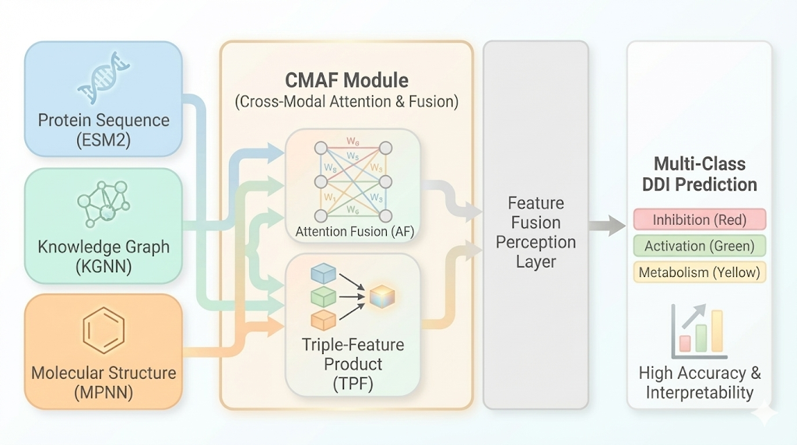

# CMAF-DDI

[](https://www.embs.org/jbhi/)
[](https://pytorch.org/)
[](https://github.com/HengpengZ/CMAF-DDI/actions/workflows/ci.yml)
[](LICENSE)

Official PyTorch implementation of **"CMAF-DDI: A Knowledge-Enhanced
Cross-Modal Fusion Method Leveraging Protein Representation for Multi-Class
Drug-Drug Interactions"**, accepted by the *IEEE Journal of Biomedical and
Health Informatics* (JBHI).



CMAF-DDI represents each drug with three complementary modalities:

- a 100-dimensional biomedical knowledge-graph representation;
- a 300-dimensional molecular-graph representation;
- a 320-dimensional ESM2 protein-sequence representation.

The Cross-Modal Attention Fusion module combines an Attention Fusion (AF)
branch with a Triple-feature Product Fusion (TPF) branch. The resulting drug
representations are concatenated in directed pairs and classified into DDI
relation types.

## What is included

- a portable training and five-fold cross-validation entry point;
- CMAF, concatenation, and summation fusion variants;
- strict input shape, label, finite-value, and row-alignment checks;
- ESM2 protein and GIN molecular feature extraction CLIs;
- data checksums and a paper-profile validator;
- independent checkpoints and metrics for every fold;
- a synthetic forward/backward smoke test and GitHub Actions CI.

## Installation

Python 3.8 or later is recommended. The core training path does not require
DGL, RDKit, or Transformers when precomputed features are used.

```bash
conda env create -f environment.yml
conda activate cmaf-ddi
python scripts/smoke_test.py
```

Alternatively, install the core packages with pip:

```bash
python -m venv .venv
source .venv/bin/activate  # Windows: .venv\Scripts\activate
python -m pip install --upgrade pip
python -m pip install -r requirements.txt
python scripts/smoke_test.py
```

Install `requirements-preprocessing.txt` only when regenerating protein or
molecular features. For GPU training, install the PyTorch build that matches
your CUDA runtime before installing the remaining requirements.

## Data

The default paper profile expects the following files:

```text
data/DRKG/
|-- drugbank_ddi.tsv
|-- Drugbank_entity.npy
|-- drugbank_mol_embeddings.npy
`-- protein_embeddings.npy
```

| File | Meaning | Required shape |
|---|---|---:|
| `drugbank_ddi.tsv` | zero-based `drug_1`, `drug_2`, `label` | `191427 x 3` |
| `Drugbank_entity.npy` | KG features; the first 1,706 rows follow drug-index order | at least `1706 x 100` |
| `drugbank_mol_embeddings.npy` | molecular graph features | `1706 x 300` |
| `protein_embeddings.npy` | ESM2 protein features | `1706 x 320` |

All feature rows must describe the same drug in the same zero-based order.
The loader intentionally stops on a 1,702-versus-1,706 row mismatch rather
than silently training on misaligned drugs.

Validate a prepared dataset before training:

```bash
python scripts/validate_data.py --data-dir data/DRKG --paper-profile --hash
```

DrugBank data are subject to DrugBank's license and are not downloaded by this
repository. Obtain the source data under an appropriate license and review the
redistribution terms before publishing derived labels or mappings. DRKG and
UniProt have their own terms. See [data/README.md](data/README.md) for the data
contract, verified release-candidate checksums, and preparation notes.

## Reproduce the main experiment

The defaults match the accepted manuscript: seed 2020, split seed 3, five
stratified folds, Adam, learning rate `1e-4`, batch size 2,048, up to 200
epochs, four attention heads, and a 2,460-dimensional FFP layer.

```bash
python main.py \
  --data-dir data/DRKG \
  --task multiclass \
  --fusion cmaf \
  --device cuda \
  --deterministic \
  --output-dir outputs/paper-cmaf
```

For a quick integration check using real files:

```bash
python main.py \
  --data-dir data/DRKG \
  --epochs 1 \
  --max-folds 1 \
  --max-train-batches 1 \
  --max-eval-batches 1 \
  --no-save-checkpoints \
  --device cpu \
  --output-dir outputs/integration-check
```

Each run writes:

```text
outputs/<run>/
|-- fold_0/best.pt
|-- fold_1/best.pt
|-- ...
|-- fold_metrics.csv
|-- run_config.json
|-- summary.json
`-- training.log
```

See [docs/REPRODUCIBILITY.md](docs/REPRODUCIBILITY.md) for the full protocol,
determinism notes, ablations, and artifact reporting requirements.
Repository owners should also complete the
[public release checklist](docs/RELEASE_CHECKLIST.md), especially its DrugBank
licensing and Git-history review, before changing repository visibility.

## Regenerate features

Protein features use `facebook/esm2_t6_8M_UR50D` and masked mean pooling over
non-special residue tokens:

```bash
python "Protein sequence/run.py" \
  --input data/DRKG/drug_protein_sequences.csv \
  --output data/DRKG/protein_embeddings.npy
```

Molecular features use the pretrained supervised-masking GIN from DGL-LifeSci.
Invalid SMILES receive zero vectors so the output keeps the input row order:

```bash
python "Molecular Graph/pretrain_smiles_embedding.py" \
  --input data/DRKG/drug_smiles.tsv \
  --smiles-column SMILES \
  --output data/DRKG/drugbank_mol_embeddings.npy
```

Both commands write a JSON metadata file next to the generated array. The
knowledge-graph code in `Knowledge Graph/` is retained for provenance but is a
legacy Keras pipeline, not the default training entry; read its local README
before using it.

## Results reported in the accepted manuscript

The following percentages are transcribed from the accepted paper. They are
reference values, not a claim that CI reruns the full 200-epoch experiment.

| Method | Macro-Precision | Macro-Recall | Macro-F1 | Accuracy |
|---|---:|---:|---:|---:|
| KGNN | 79.94 | 73.77 | 75.92 | 92.58 |
| MUFFIN | 94.53 | 92.38 | 93.08 | 96.96 |
| HetDDI | 96.04 | 96.27 | 96.17 | 98.13 |
| **CMAF-DDI** | **97.36** | **96.96** | **96.95** | **98.19** |

The paper also reports 24,691,566 trainable parameters for the default model.
`scripts/smoke_test.py` asserts this count to prevent architecture drift.

## Repository layout

```text
.
|-- main.py                         # training and cross-validation
|-- models/model.py                 # CMAF-DDI architecture
|-- utils/                          # data validation, metrics, runtime helpers
|-- scripts/validate_data.py        # real-data contract and checksum check
|-- scripts/smoke_test.py           # synthetic forward/backward test
|-- Protein sequence/run.py         # ESM2 feature extraction
|-- Molecular Graph/                # GIN molecular feature extraction
|-- Knowledge Graph/                # legacy KGNN provenance code
|-- data/README.md                   # data contract and licensing boundary
`-- docs/REPRODUCIBILITY.md          # experiment protocol
```

## Citation

The final volume, pages, and DOI are not yet included in the supplied accepted
manuscript. Until the IEEE record is available, cite the accepted article as:

```bibtex
@article{zhao2026cmafddi,
  title   = {CMAF-DDI: A Knowledge-Enhanced Cross-Modal Fusion Method
             Leveraging Protein Representation for Multi-Class Drug-Drug
             Interactions},
  author  = {Zhao, Hengpeng and Lin, Xiaoli and Pang, Jun and Li, Bo and
             Zhang, Xiaolong},
  journal = {IEEE Journal of Biomedical and Health Informatics},
  year    = {2026},
  note    = {Accepted}
}
```

## License

The source code is released under the [MIT License](LICENSE). Dataset,
pretrained-model, and third-party dependency licenses apply separately.
